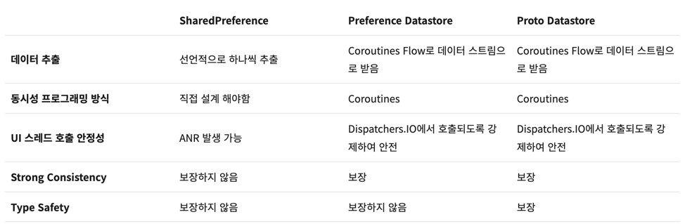

# :core:datastore-proto module

## 왜 proto를 사용하는가?
- kotlin, java, c++, python 등 다양한 언어를 지원한다.
- 
## gradle

```groovy
androidComponents.beforeVariants { variant ->
    val variantName = variant.name
    
    val buildDir = layout.buildDirectory.get().asFile
    val javaSrcDir = buildDir.resolve("generated/source/proto/${variantName}/java")
    val kotlinSrcDir = buildDir.resolve("generated/source/proto/${variantName}/kotlin")
    
    android.sourceSets.getByName(variantName).run {
        java.srcDir(javaSrcDir)
        kotlin.srcDir(kotlinSrcDir)
    }
}
```

- 위의 코드는 proto를 통해 생성된 java, kotlin 파일들을 모듈의 build/generated/source/proto/${variantName}/java, kotlin 디렉토리에 추가하는 코드이다.
- 또한 생성된 모듈을 git에 올리기 위해 .gitignore 파일을 제거한다.